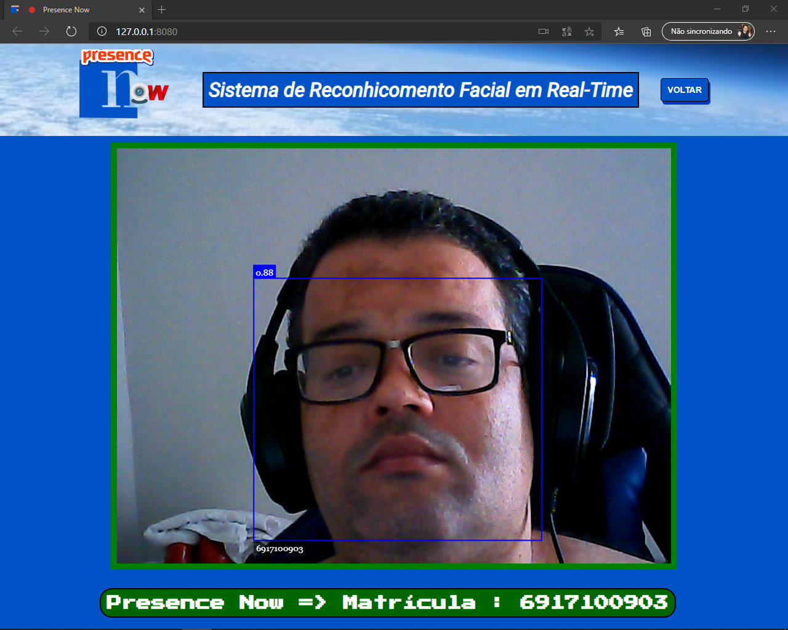

# Presence Now - Módulo de Reconhecimento

Presence Now é um software de aferição de assiduidade estudantil por reconhecimento facial em real-time , o FrontEnd foi desenvolvido em react utilizando typescript ,
o BackEnd utiliza as mesmas linguagens, e foi implementado em formado de Rest API, o módulo de reconhecimento facial utiliza apenas Javascript, HTML e CSS ,
mas faz uso da faceapi.js que utiliza a API do tensorflow.js e implementa uma série de redes neurais convulsionais (CNNs).
O sistema basicamente vai fazer o registro da presença do aluno através do reconhecimento facial em tempo real.
O Projeto foi meu trabalho de conclusão de curso (TCC) e aprovado com nota máxima.   
<a href="https://presencenowreconhecimento.netlify.app/">`Site Presence Now - Reconhecimento`</a>   
<a href="https://youtu.be/eUG6Kn9ahx0">`Video demostração Youtube`</a>
#
   

